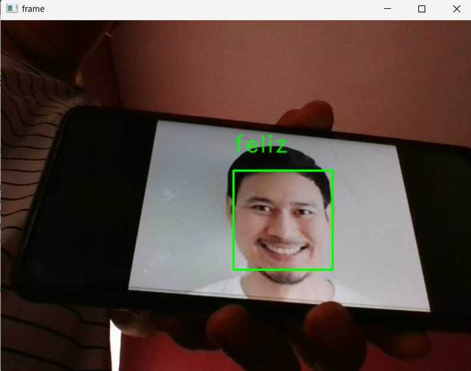
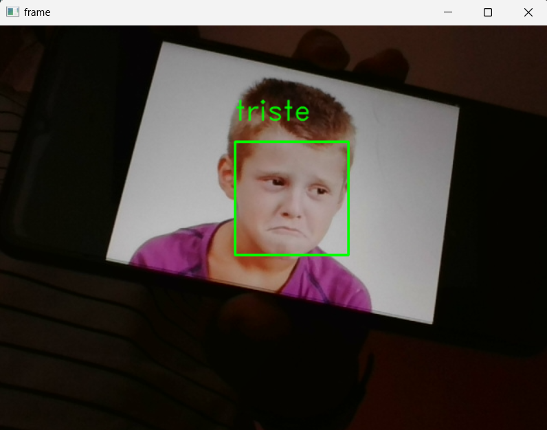
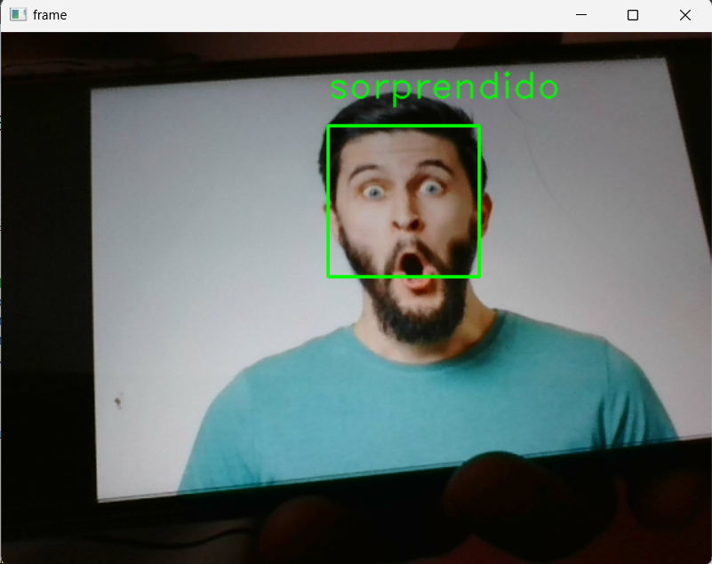
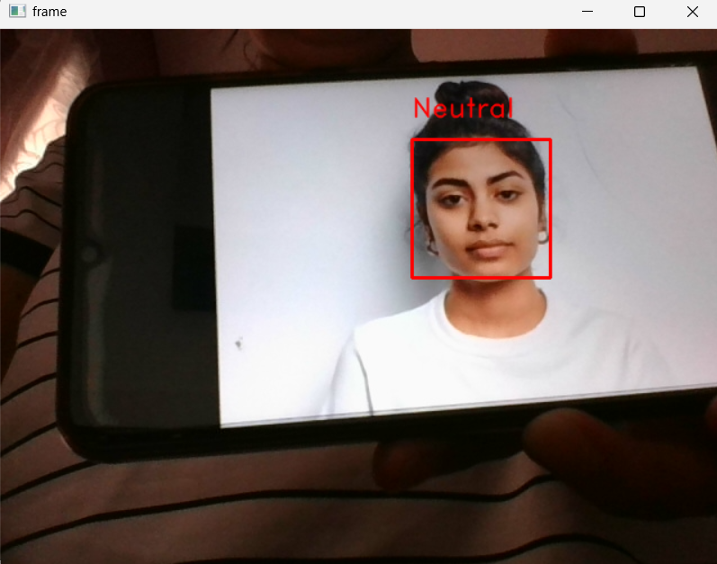

# Documentación Proyecto 1: "Reconocimiento de Emociones"

## Objetivo
Utilizando la librería OpenCV, se busca entrenar un modelo de IA, como LBPH, EigenFace o FisherFace, que sea capaz de detectar tres estados de ánimo: Feliz, Triste y Sorprendido.

## Descripción
Para este proyecto, se decidió entrenar un modelo LBPH (Local Binary Patterns Histograms), el cual fue entrenado con un total de 3,000 imágenes, distribuidas equitativamente entre las tres emociones (1,000 imágenes por emoción).

## Proceso de Recopilación de Información y Explicación del Código Utilizado

### Recopilación de Imágenes
1. **Selección de Fuentes**: Se seleccionaron diversas fuentes de imágenes, incluyendo bases de datos públicas y fotos tomadas manualmente.
2. **Recopilacion de Imágenes**: El dataset fue capturado utilizando imagenes de diferentes individuos realizando expresiones con las emociones: Feliz, Triste o Sorprendido. 
3. **Preprocesamiento**: Las imágenes fueron redimensionadas a un tamaño estándar y convertidas a escala de grises para facilitar el procesamiento.
4. **Preprocesamiento**: Antes de comenzar con el proceso las imágenes fueron limpiadas y cuidadosamente seleccionadas.

### Librerias utilizadas
A continuación, se muestran las librerias implementadas y la instancia al clasificador "haarcascad":

```python
import numpy as np 
import cv2 as cv
import os

rostro = cv.CascadeClassifier(cv.data.haarcascades + 'haarcascade_frontalface_alt.xml')
```

### Proceso de captura de imagenes.
A continuación, se muestra el codigo utilizado para realizar la recopilacion de las imagenes la cuales estan diponibles en el siguiente vinculo: [Dataset Emociones](https://itecm-my.sharepoint.com/:f:/g/personal/l20120097_morelia_tecnm_mx/EqH2fVTDrHBDrTtfPYeoNO8Bt9_ST9z-0hnQWndTufhg_g?e=KccBsi)

El codigo se encarga de transformar las imagenes a escala de grises, la detaccion de rostros, recorte y la redimencion, asi como tambien de guardar las imagenes en un directorio especifico.

```python
def escala(imx, escala):
    width = int(imx.shape[1] * escala / 100)
    height = int(imx.shape[0] * escala / 100)
    size = (width, height)
    im = cv.resize(imx, size, interpolation = cv.INTER_AREA)
    return im
```

```python
cap = cv.VideoCapture(0)
i = 0 

while True:
    ret, frame = cap.read()
    gray = cv.cvtColor(frame, cv.COLOR_BGR2GRAY)
    rostros = rostro.detectMultiScale(gray, scaleFactor=1.3, minNeighbors=5)

    for (x, y, w, h) in rostros:
        cara_recortada = frame[y:y+h, x:x+w]
        cara_recortada = cv.resize(cara_recortada, (100, 100), interpolation=cv.INTER_AREA)
        cv.imwrite(r'D:\IA\Proyecto_1 Emociones\Sentimientos\triste\imgb2' + str(i) + '.png', cara_recortada)

    cv.imshow('rostros', frame)
    i += 1


    k = cv.waitKey(1)
    if k == 27:
        break

cap.release()
cv.destroyAllWindows()
```
### Entrenamiento del Modelo LBPH

El siguiente codigo se encarga de crear un arreglo con las etiquetas marcadas en el directorio con las imagenes que se utilizaran para educar el modelo.

```python

dataSet = 'D:\IA\Proyecto_1 Emociones\Sentimientos'
faces  = os.listdir(dataSet)
print(faces)

```
El siguiente codigo se encarga de leer las imagenes y entrenar el modelo LBPH para genera el moelo emociones.xml que se encuentra disponible en la siguiente liga: [Modelo Emociones.xml](https://itecm-my.sharepoint.com/:f:/g/personal/l20120097_morelia_tecnm_mx/EqH2fVTDrHBDrTtfPYeoNO8Bt9_ST9z-0hnQWndTufhg_g?e=KccBsi)

```python
dataSet = 'D:\IA\Proyecto_1 Emociones\Sentimientos'
faces  = os.listdir(dataSet)
print(faces)

labels = []
facesData = []
label = 0 
for face in faces:
    facePath = dataSet+'/'+face
    for faceName in os.listdir(facePath):
        labels.append(label)
        facesData.append(cv.imread(facePath+'/'+faceName,0))
    label = label + 1
print(np.count_nonzero(np.array(labels)==0)) 

LBPHFace = cv.face.LBPHFaceRecognizer_create()
LBPHFace.train(facesData, np.array(labels))
LBPHFace.write('emociones.xml')

```

# Uso del modelo

Por ultimo, es necesario utilizar el siguiente codigo para usar el modelo para verificar su funcionalidad.

```python
faces  = ['feliz', 'sorprendido', 'triste']
LBPHFace = cv.face.LBPHFaceRecognizer_create()
LBPHFace.read('emociones.xml')

cap = cv.VideoCapture(0)
rostro = cv.CascadeClassifier(cv.data.haarcascades +'haarcascade_frontalface_alt.xml')
while True:
    ret, frame = cap.read()
    if ret == False: break
    gray = cv.cvtColor(frame, cv.COLOR_BGR2GRAY)
    cpGray = gray.copy()
    rostros = rostro.detectMultiScale(gray, 1.3, 3)
    for(x, y, w, h) in rostros:
        frame2 = cpGray[y:y+h, x:x+w]
        frame2 = cv.resize(frame2,  (100,100), interpolation=cv.INTER_CUBIC)
        result = LBPHFace.predict(frame2)
        if result[1] > 93:
            cv.putText(frame,'{}'.format(faces[result[0]]),(x,y-25),2,1.1,(0,255,0),1,cv.LINE_AA)
            cv.rectangle(frame, (x,y),(x+w,y+h),(0,255,0),2)
        else:
            cv.putText(frame,'Neutral',(x,y-20),2,0.8,(0,0,255),1,cv.LINE_AA)
            cv.rectangle(frame, (x,y),(x+w,y+h),(0,0,255),2)
    cv.imshow('frame', frame)
    k = cv.waitKey(1)
    if k == 27:
        break
cap.release()
cv.destroyAllWindows()

```

# Resultados 









