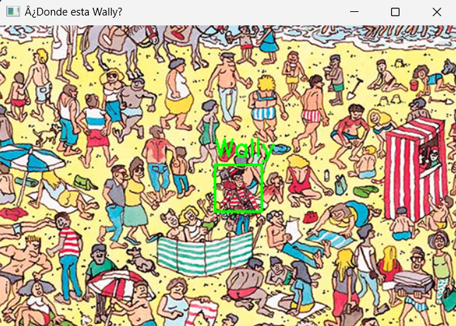
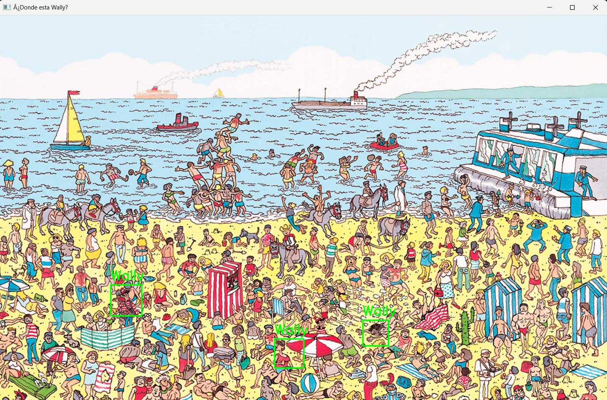

# Proyecto: ¿Dónde está Wally?

## Objetivo
Utilizando el `CascadeClassifier` de la librería OpenCV, crea un algoritmo capaz de detectar a Wally.

## Pasos a Seguir

### Paso 1: Generar Dataset
Generar un dataset con imágenes organizadas en las siguientes carpetas:
- **Imágenes Positivas (p)**: Imágenes que contienen al personaje Wally.
- **Imágenes Negativas (n)**: Imágenes que no contienen a Wally.

dicho data set se encuentra disponible en la siguiente liga: [DataSet Wally](https://itecm-my.sharepoint.com/:f:/g/personal/l20120097_morelia_tecnm_mx/EqH2fVTDrHBDrTtfPYeoNO8Bt9_ST9z-0hnQWndTufhg_g?e=KccBsi)

### Paso 2: Generar el XML
Utiliza el **Cascade Trainer GUI** para generar el archivo XML.

- En el apartado **Input** 
    - Ubicar el directorio donde se encuentran las carpetas (p) y (n)
    - Utiliza del 80-100% de imágenes positivas
    - Utiliza el total de imágenes negativas

- En el apartado **Commom** 
  - Ajusta el pre-calculate values e indices en 2000 iteraciones

- En el apartado **Cascade y Boost**
  - Puedes dejar los parámetros por defecto


una vez que termine la ejecucion, se creara un archivo .xml el cual se encuentra disponible en la siguiente liga:  [cascade.xml](https://itecm-my.sharepoint.com/:f:/g/personal/l20120097_morelia_tecnm_mx/EqH2fVTDrHBDrTtfPYeoNO8Bt9_ST9z-0hnQWndTufhg_g?e=KccBsi)

### Paso 3: Importar y ajustar Parámetros

Importa el modelo y pruebalo con el siguinete codigo: 


```python

image = cv.imread(r'ruta_de_la_imagen')
gray = cv.cvtColor(image, cv.COLOR_BGR2GRAY)

wally = cv.CascadeClassifier(r'D:\IA\Proyecto_2 Waldo\cascade.xml')

waldo_detections = wally.detectMultiScale(gray, scaleFactor=1.07, minNeighbors=10, minSize=(5,5))

for (x, y, w, h) in waldo_detections:
    cv.rectangle(image, (x, y), (x+w, y+h), (0, 255, 0), 2)
    cv.putText(image, 'Wally', (x, y-10), cv.FONT_HERSHEY_SIMPLEX, 0.9, (0, 255, 0), 2)


cv.imshow('¿Donde esta Wally?', image)
cv.waitKey(0)
cv.destroyAllWindows()

```

Ajusta los parámetros del `CascadeClassifier`:
- `scaleFactor`
- `minNeighbors`
- `minSize`

Estos pueden variar con cada imagen. 

### Paso 4: Verificar resultados. 





