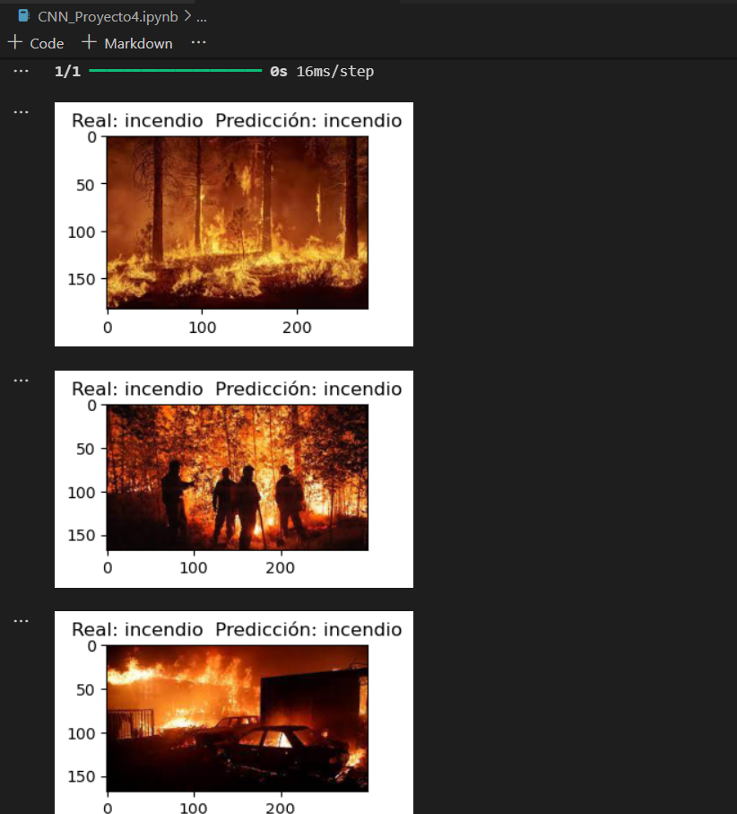
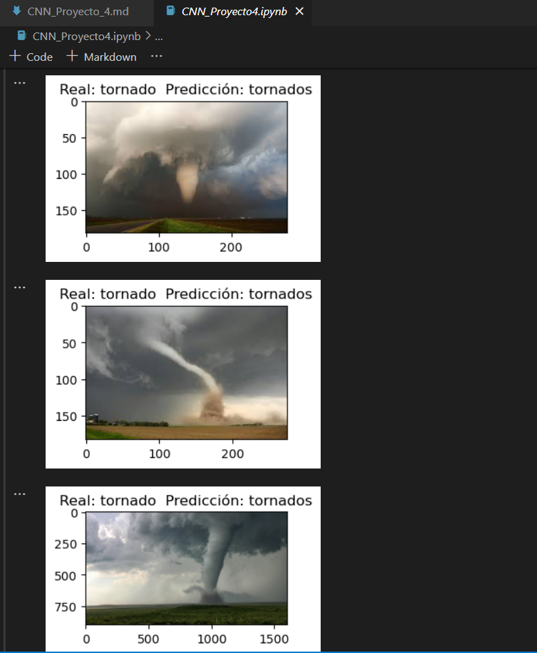
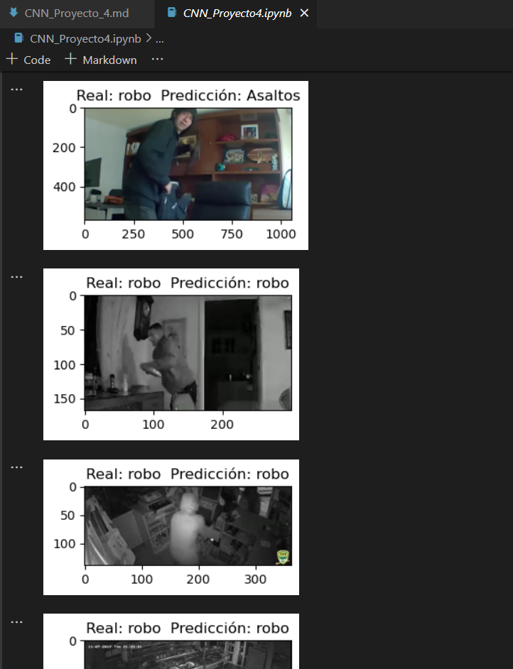
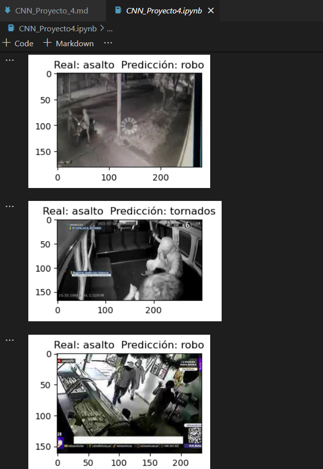

### Proyecto 4
#### Objetivo: Crea una CNN (Convolutional Neural Networks) que sea capaz de detectar situaciones de riesgo.

#####  1. Importar Librerías Generales 
- numpy
- os
- matplotlib
- sklearn

#####  2. Importar Librerías  Tensorflow y  keras
- sklearn
- tensorflow 
- keras

##### 3. Cargar Imágenes para crear el DataSet
Cargar dataset de imagenes de riesgo tamaño de 28x28 recopiladas y que se encuentran disponibles en la siguiente liga: [Dataset Riegos](https://itecm-my.sharepoint.com/:f:/g/personal/l20120097_morelia_tecnm_mx/EqH2fVTDrHBDrTtfPYeoNO8Bt9_ST9z-0hnQWndTufhg_g?e=KccBsi)

##### El objetivo es detectar 5 situaciones de riesgo. 
- Tornados 
- Incendios
- Inundaciones 
- Robo Casa-Habitación
- Asaltos
##### 4. Crear etiquetas   
##### 5. Dividimos el set en: entrenamiento y test.
##### 6.Procesamiento de imagenes
##### 7.Crear el One-hot Encoding para la CNN
##### 8. Creamos el Set de Entrenamiento y Validación
##### 9. Creamos el modelo de CNN
##### 10. Entrenamos el modelo: Aprende a clasificar imágenes
##### 11. Guardar el modelo generado
##### 12. Evaluar el modelo
##### 13. Comprobar el rendimiento con el set de prueba
##### 14. Comparacion para obtener retroalimentacion   
#####  15. Probar modelo. 

El paso a paso se puede encontrar en el juyter-notebook, con el codigo correspondiente. 
Podemos comprobar la efectividad de la red neuronal ejecutando el siguente codigo 

```python
images=[]

for filepath in filenames:
    image = plt.imread(filepath,0)
    image_resized = resize(image, (28, 28),anti_aliasing=True,clip=False,preserve_range=True) #CAMBIAR
    images.append(image_resized)

X = np.array(images, dtype=np.uint8) 
test_X = X.astype('float32')
test_X = test_X / 255.

predicted_classes = risk_model.predict(test_X)

for i, img_tagged in enumerate(predicted_classes):
    #print(filenames[i], risk[img_tagged.tolist().index(max(img_tagged))])
    img = plt.imread(filenames[i])
    plt.figure(figsize=(3,3))
    plt.imshow(img)
    plt.title(f"Real: {categorias[i]}  Predicción: {risk[img_tagged.tolist().index(max(img_tagged))]}")
    plt.show()

```

## Resultados

La red neuronal es capaz de detectar los 5 riesgos con un accuracy del 0.93






